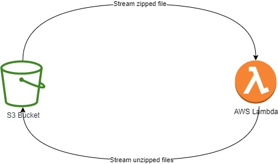

# Unzip large files with Lambda and S3

This is based on the following article: [Unzip large files from S3 with Lambda 🚀](https://medium.com/@tshepomakhubela/unzip-large-files-from-s3-with-lambda-ee2555fd41b3)

## Getting started

To get started, you can run the following commands from the root directory:

**Note: This might incur costs in your AWS account which you should account for.**

`npm i`

`npm run deploy --stage dev`

This will install the dependencies for the project and deploy the project to AWS.

> To remove the project you can run the following command:

`npm run remove --stage dev`